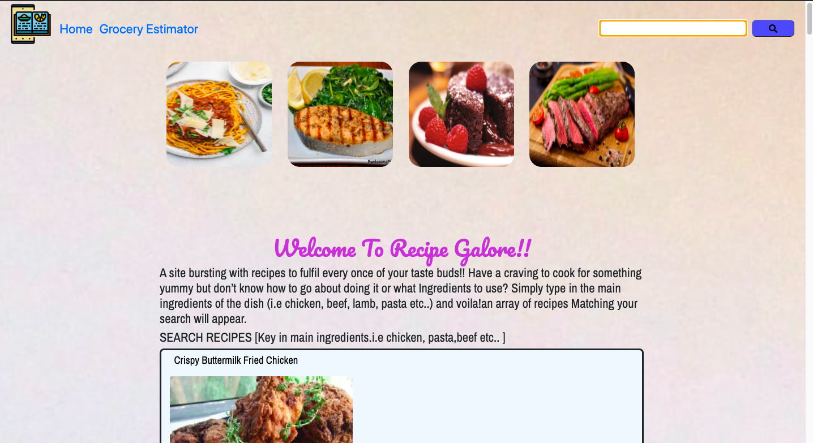

# About this site.

We were presented with a task to reflect what we have learned about javascript.
I took the opportunity to create an recipe search engine where users can key in the main igredients of the type of dish they are looking for and the server returnsa a list of popular dishes with instructions for the user to try
I also imprted an idea from spoonacular to provide the users an estimate how much the dish would cost by keying in the ingredients 
and have returned to them a list and prices of the ingredients they keyed in.
I decided to go for a simple, fresh and easy to navigate webpage so that the user can easily run searches. 

# Demo 

Click <a href= https://muhammad-mo.github.io/Project2-Recipe-Database/ target="blank">Here</a> to see a demo of the website.

# User Interface

The goal of the website is to allow users to find out recipes of the main ingredients they are looking for by keying in the main 
ingredients in the search engine.

# Programmig Lnguage used

1. HTML
2. CSS
3. Bootstrap 
4. Javascript

# Features

The overall website's look is achieved as planned. Users are able to search for recipes of the main gradient.
by keyeing in the main ingredient in the search button and array of recipes with instructions will display
The users will also be able to get a price estimate of the ingredients they intend to use

# Features left to implement

The future plans for this wensite is to include a calorie calculator where users can calculate and find out
how much Kcal they are consuming by keying in the ingredients and quantity

# Deployment

THe site was deployed on Github via this link
Click <a href= https://muhammad-mo.github.io/Project2-Recipe-Database/ target="blank">Here</a>

# Content

All content was authored by me and referenced from pages which are mentioned in the Credit Section

# Media

Pictures for the home page were taken from
1. https://thehoneycombers.com
2. https://www.eazypeazymealz.com/
3. https://www.dinneratthezoo.com/
4. https://www.tasteofhome.com/
5. https://panlasangpinoy.com/

# Credit

References,Javascript and bootstrap codes were used from the following websites

1. https://www.stackoverflow.com
2. https://www.w3schools.com
3. https://www.w3.org/
4. https://getbootstrap.com/
5. https://spoonacular.com/food-api
6. https://github.com/ddsky/spoonacular-widgets

# Page Structure Design 

<h2> Layout and Design </h2>

The page layout was designed with this deisgn originally as such using Adobe wireframe

Header includes a logo which when click brings user to homepage.
The main content section will display food examples and a brief write up about the website.
Users will be able to search recipes based on key ingredient keyed in
Users will be able to navigate to a menu price estimator when clicking on the link

# Function & Operation

<h2> Main Page </h2>

The main page was designed with the intention of allowing the users to search for their favourite
recipes by filling the form field with keywords like "chicken", "beef" , "lamb", "Pasta", "Fish"
and an array of recipes matching their key words will be displayed.

<h2> Menu Price Estimator </h2>

This page allows the user to key in all the ingredients that they would
like to use and upon clicking the "Price Visualizer" button a chart 
with a list of the chosen ingredients and prices and chart will be displayed

<h2> Recipe Button </h2>

Clicking the recipe button allows the user to see the ingredients
and steps of the recipe

# Testing

The Following tests was conducted

1)https://validator.w3.org/nu/

2)https://jigsaw.w3.org/

3) Buttons and Links

a)The Search button was tested and works exactly as intended. Users are able too see a list of 
recipes after keying in the main ingredient and clicking the search button

b)The recipe button was tested and worked exactly as intended. Users are able to see the ingredients and steps
when clicking on the button

b)The home button was tested. Clicking it brings the user back to home page as intended

c)The price estimator button was tested. Clicking the button after keying in your groceries 
shows the user thr price breakdown and chart

d)The link to the price estimator page works as intended when being clicked

d)The apiKey from spooncaular was tested to see if results were able to be retrieved using postman
Results were able to be fetched from Spoonacular API.

# Resubmission 

This project had to be re-submitted because of the following errors which was recitifed or minimized

1. Balanced layout present with key and supporting interactions judiciously grouped, Site not straightforward to navigate or use., While accessibility is demonstrated through use of alt attributes, a few of the alt tags are not accurate for the images (eg. "responsive image" is not considered a good alt attribute). Every CTA offers very low contrast. Further, there is no way to navigate across the different pages without using the browser's back button.

<b>correction done</b>: image'alt' tags in index page were changed to describe the actual image and images were resized
to ensure responsiveness

2. Obvious to user how to interact with the site, However, there is no feedback added for error handling.

<b>correction done</b>: Alert box appear to remind users to enter ingredients correctly without spelling mistakes

3. No	HTML and CSS code doesnt pass through the official validator without any issues, 4 CSS errors. 11 errors and 2 warnings in HTML on https://muhammad-mo.github.io/Project2-Recipe-Database/menuprice2.html

<b>correction done</b>: Errors were minimized 

4. 	File naming and directory is inconsistent.

<b>correction done</b>:  CSS files placed in assets folder
                     :  JS files were renamed 
                     :  All images are put into an image folder

 
